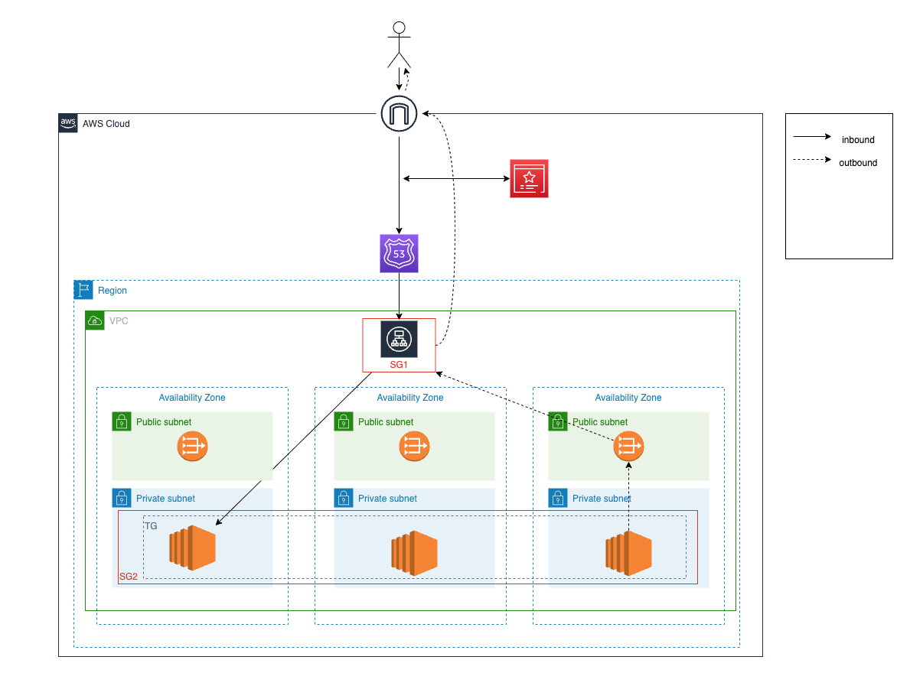

# Terraform for AWS Solutions Project

ToDo: 
- [ ] setup different environments
    - new ec2 machine per environment?
    - another docker network and domain for other environment on same ec2?
- [ ] access mgmt? 
    - start/stop instance with pipeline in gitlab?

    - Usecase: 
        - Developer wants to test his code in a shared environment
        - Developer start ec2 with flag for env (support or develop , xs2a, modelbank etc.)
        - Developer can see changes in shared environment
        (- Developer needs to interact with environment - like logs?)
        - Developer shuts down shared Environment

This is a mockup of the IaC Code in this Project
---

